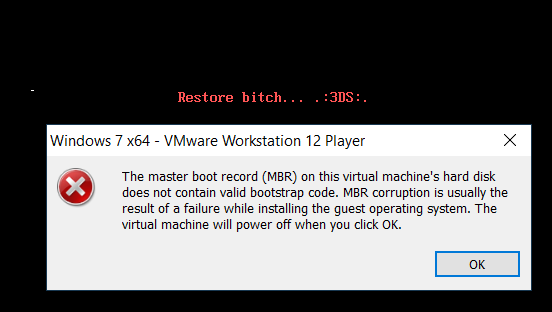

W32.killah
===
**Category:** Reverse Engineering, **Points:** 500, **Solves:** 19

> Caution.. "The flag is over there.."
>
> Password: "infected!"
>
> WARNING! DON'T EXECUTE THIS SAMPLE IN YOUR OWN PERSONAL MACHINE!!!

### Write-up

Again authors warn us not to run this executable on personal machine, so let's run it on virtual machine. Console pops up, windows restarts, well we know it happens and... windows doesn't start up

The excecutable overriden MBR... Luckily I haven't run it on my machine.

So let's see what is inside. This time executable is really simple. There is function which adds and xors bytes

    .text:004011A9 xor_add
    .text:004011AB loopstep:
    .text:004011AB                 add     [edx], al
    .text:004011AD                 xor     [edx], al
    .text:004011AF                 inc     edx
    .text:004011B0                 loop    loopstep

To each byte in array under `edx` address, it adds value from `al`, then xors it with `al`, `ecx` contains length of byte array (`loop` instruction decrements `ecx` each time and jumps if it is nonzero).

So in the `start` function, we use `xor_add` with byte `@` and array of 14 bytes. However manually add and xor doesn't give printable results. Let's go further. Then some other function is called which opens file `\\.\PhysicalDrive0`.... So we know what has overriden the MBR. And on the first sight that's all. So where is the flag then? 

After more investigation it turnes out there is unused code which again calls `xor_add` on the same byte array, this time with space char (` `). Then let's try to `xor_add` two times - firstly with byte `@`, then space:

    void xor_add(char chr, char* array, int len)
    {
        while (len--)
        {
            *array += chr;
            *array++ ^= chr;
        }
    }

    int main()
    {
        char flag1[] = {115, -60, -45, 59, 45, 116, 44, 55, -64, 50, 115, -33, 113, 0, -77, -33, -90, -75, -93, -53, -87, -82, -57, -33, -90, -75, -82, -31, -67, 0, 0};
        xor_add('@', flag1, 14);
        xor_add(' ', flag1, 14);

        printf("%s\n\n", flag1);
    }

The result looks really good!

    3DS{m4lw@r3_1

but it certainly doesn't look like whole flag. Let's check references to our function `xor_add` and it shows us two more calls on array elements `14 - 30`. This time firstly against space, then `@`.

    xor_add(' ', flag1+13, 16);
    xor_add('@', flag1+13, 16);

and we have the rest of the flag: `s_fucKinG_fun!}`. So the whole flag is:

   3DS{m4lw@r3_1s_fucKinG_fun!}

What is the conclusion? Do not run unknown executables!
   
###### Bartek aka bandysc 
