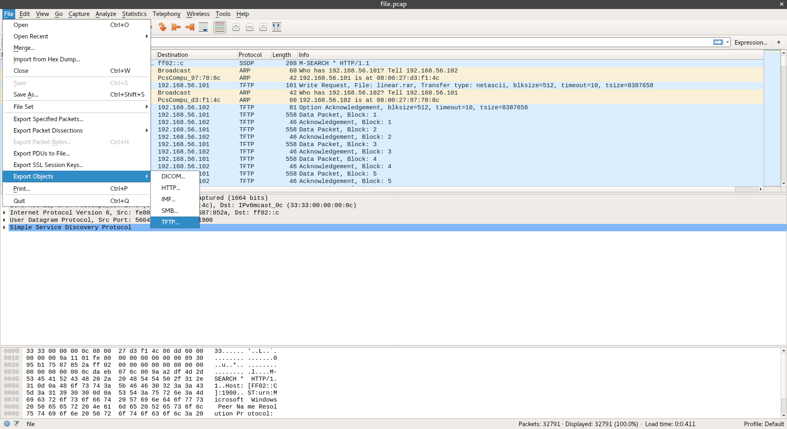
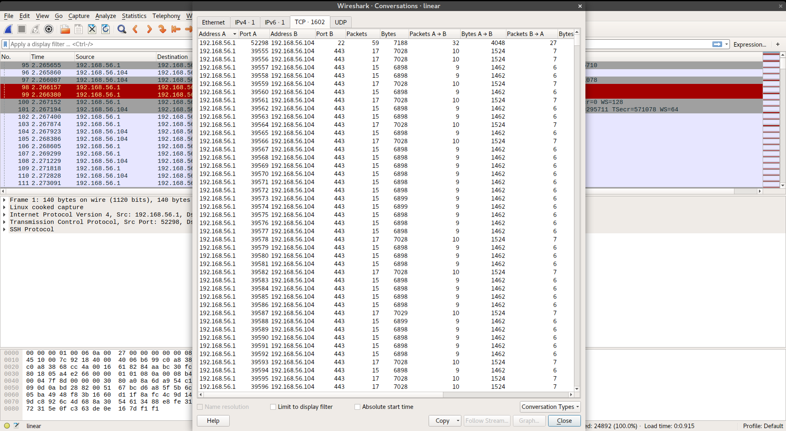

BREACH
===
**Category:** Forensics **Points:** 400, **Solves:** 1, **Our rank:** 1

> The attacker has infiltrated our network and stoled our token.
> we captured packets that the attacker's sniffer module send to him.
> can you tell us what token was extracted? Attacker knows our token format is : token={[a-z]{32}}
> The flag is SharifCTF{Token}.

### Write-up

We are given a pcap file, a quick look shows many TFTP packets. Fortunately wireshark can easily help with that:



We obtain `linear.rar` file, which contains a single `linear.pcap` file. Here we go again:



This time we see multiple short TLS 1.2 sessions. Closer look reveals they are very similar, each consists of a single request and response and all are of similar sizes.
This definitely looks like some kind of attack agains tls, and challenge name helps to find [breachattack.com](http://breachattack.com).

This is a very creative attack abusing http compression and the fact that tls does not hide length of transmitted data to obtain parts of plaintext.
The basic idea is that if response contains secret data and reflects some of the data from request, it might compress slightly better if secret data is repeated in reflected data.
For example, consider query

```
GET vunlsite.com/?q=token%3Da
```

If the response looks like that:

```
You searched for: <span>token=a</span>
<a href="form?token=abcjkjfejfwelf></a>
```

It may be compressed better (by algorithms based on [LZ77](https://en.wikipedia.org/wiki/LZ77_and_LZ78) or similar) if the token indeed starts with 'a'.
Then, by tricking victim to run multiple queries like that, and observing response sizes, we may leak secrets. Common targets to leak are cookies or csrf tokens.

I highly recommend to read more about it, it's captivating. I started with the [paper](http://breachattack.com/resources/BREACH%20-%20SSL,%20gone%20in%2030%20seconds.pdf) and [PoC](https://github.com/nealharris/BREACH).

Everyting suggests that what we see is a record of a BREACH attack, targeted to obtain the token. We need to do the same thing, but blindly - we don't know what requests exactly did attacker send.

First thing is to obtain requests and responses lengths. I used python [scapy library](http://www.secdev.org/projects/scapy/) with [scapy-ssl_tls](https://github.com/tintinweb/scapy-ssl_tls) for that.
The following quick-and-dirty snippet does exactly that. It first filters only application data packets -
ones that carry `TLSCiphertext` and contain expected number of `TLSRecord`s - as all requests had one, and responses four.
Then it groups requests and responses together, and gets the sizes.

```
from scapy.all import *

def load():
    packets = rdpcap('linear.pcap')
    # Take only application data and pair req, resp
    p2 = packets.filter(lambda p: p.haslayer(TLSCiphertext) and len(p.lastlayer().records) in [1,4])
    ts = [(p2[2*i].lastlayer(), p2[2*i+1].lastlayer()) for i in xrange(1600)]
    # Req, resp lengths
    ls = [(a[0].records[0].length, a[1].records[2].length) for a in ts]
    return ls
```

We end up with an array of 1600 pairs of ints, and now the guessing game begins. The base idea behind BREACH is simple -
we guess token byte by byte, by appending to already known prefix every possible next character. There is also a variant which
only guesses a few first characters this way and then uses some kind of binary search.
This seemed like an overkill though for 32 bytes of token, and in hindsight, filename "linear" also suggests against it.

Initial analysis confirms that attacker sends slowly growing requests, but the number of requests of each length seems to vary wildly.

```
In [9]: [(req, len(list(resps))) for req, resps in itertools.groupby(ls, lambda x: x[0])]
Out[9]:
[(240, 104),
 (241, 2),
 (242, 6),
 (243, 4),
 (244, 30),
 (245, 10),
 (246, 104),
 (247, 104),
 (248, 104),
 (249, 168),
 (250, 104),
 (251, 104),
 (252, 612),
 (253, 144)]
```

I would expect to see all request lengths from n to n+32 for some n, each repeated between 1 and 26 times. This was not the case, and I'm still not sure why there are less then 32 request lengths.
One explanation could be request compression, but I believe it's rarely used.

Further reading about BREACH shows that attack does in fact two requests for each guess.
If we know part of the secret and guess subsequent character, then we send two requests, containing correspondingly:
`knownPart + guess + padding` and `knownPart + padding + guess`, where padding consists of characters which do not appear in the secret.
We then compare lengths of the two requests, and if the first one gives shorter response, the guess is probably correct! This is to eliminate effects of Huffman encoding,
also used in gzip, and increase stability. Different padding lengths may also be used.

The good news is that number of requests for each length is even, which indicates this strategy was used here. We should group the requests in pairs and compare response lengths.

```
In [10]: l2 = [ls[2*i:2*(i+1)] for i in xrange(len(ls)/2)]

In [11]: [(i,x) for i,x in enumerate(l2) if x[0] < x[1]]
Out[11]:
[(52, [(241, 3661), (241, 3662)]),
 (55, [(242, 3661), (242, 3662)]),
 (57, [(243, 3661), (243, 3662)]),
 (72, [(244, 3661), (244, 3662)]),
 (77, [(245, 3661), (245, 3662)]),
 (251, [(249, 3666), (249, 3667)]),
 (254, [(249, 3667), (249, 3668)]),
 (265, [(249, 3667), (249, 3668)]),
 (436, [(252, 3670), (252, 3671)]),
 (458, [(252, 3670), (252, 3671)]),
 (476, [(252, 3670), (252, 3671)]),
 (490, [(252, 3670), (252, 3671)]),
 (515, [(252, 3670), (252, 3671)]),
 (535, [(252, 3670), (252, 3671)]),
 (556, [(252, 3670), (252, 3671)]),
 (577, [(252, 3670), (252, 3671)]),
 (597, [(252, 3670), (252, 3671)]),
 (612, [(252, 3670), (252, 3671)]),
 (625, [(252, 3670), (252, 3671)]),
 (629, [(252, 3670), (252, 3671)]),
 (646, [(252, 3670), (252, 3673)]),
 (653, [(252, 3670), (252, 3672)]),
 (657, [(252, 3670), (252, 3671)]),
 (675, [(252, 3670), (252, 3671)]),
 (728, [(253, 3672), (253, 3673)]),
 (734, [(253, 3672), (253, 3673)]),
 (754, [(253, 3672), (253, 3673)]),
 (777, [(253, 3672), (253, 3673)]),
 (778, [(253, 3672), (253, 3673)]),
 (796, [(253, 3672), (253, 3673)]),
 (798, [(253, 3672), (253, 3673)]),
 (799, [(253, 3672), (253, 3673)])]
```

The output above is really promising! We have found exacly 32 "events" where first response is shorter.
Moreover, they correlates well with request length grow and contain the last query.

The simplest algorithm attacker could have used would look like that:
```
known_token = "token="
padding = "{}{}{}{}{}"
for _ in xrange(32):
  for guess in "abcdefghijklmnopqrstuvwxyz":
    len1 = len(get_response(query = known_token + guess + padding))
    len2 = len(get_response(query = known_token + padding + guess))
    if len1 < len2:
      known_token += guess
      break
```

So to obtain the token we could just count number of queries between the "events".

```
In [12]: [y - x for x, y in zip([-1] + s[:-1], s)]
Out[12]: [53, 3, 2, 15, 5, 174, 3, 11, 171, 22, 18, 14, 25, 20, 21, 21, 20, 15, 13, 4, 17, 7, 4, 18, 53, 6, 20, 23, 1, 18, 2, 1]
```

Well, apparently there are some differences greater than 26, so attacker must have used some more elaborate algorithm. This is not too suprising,
as this simple approach can fail to find the correct guess due to unpredictable compression opportunities.

One technique to increase attack success probability, described in paper and implemented in PoC, is to guess two chars at once if we fail to guess by one.
The algorithm would then look like that:

```
known_token = "token="
padding = "{}{}{}{}{}"
for _ in xrange(32):
  found = False
  for guess in "abcdefghijklmnopqrstuvwxyz":
    len1 = len(get_response(query = known_token + guess + padding))
    len2 = len(get_response(query = known_token + padding + guess))
    if len1 < len2:
      found = True
      known_token += guess
      break
  if not found:
    for g1 in "abcdefghijklmnopqrstuvwxyz":   # Loop 1
      for g2 in "abcdefghijklmnopqrstuvwxyz": # Loop 2
        len1 = len(get_response(query = known_token + g1 + g2 + padding))
        len2 = len(get_response(query = known_token + padding + g1 + g2))
        if len1 < len2:
          known_token += g1
          break
```

If this is the case, we also can recover the token easily, but there is one more
variable to consider - the order of loops may differ. Therefore, this approach gives us two potential tokens.

```
diffs = [y - x for x, y in zip([-1] + s[:-1], s)]
fs = [(x-1, (x - 26 - 1) / 26, (x - 26 - 1) % 26) for x in ds]
f1 = [x[0] if x[0] < 26 else x[1] for x in fs]
f2 = [x[0] if x[0] < 26 else x[2] for x in fs]
print ''.join(string.lowercase[i] for i in f1)
print ''.join(string.lowercase[i] for i in f2)
```

And the second of them turns out to be correct: SharifCTF{acboerckovrnytuutomdqgdraftwarba} !
