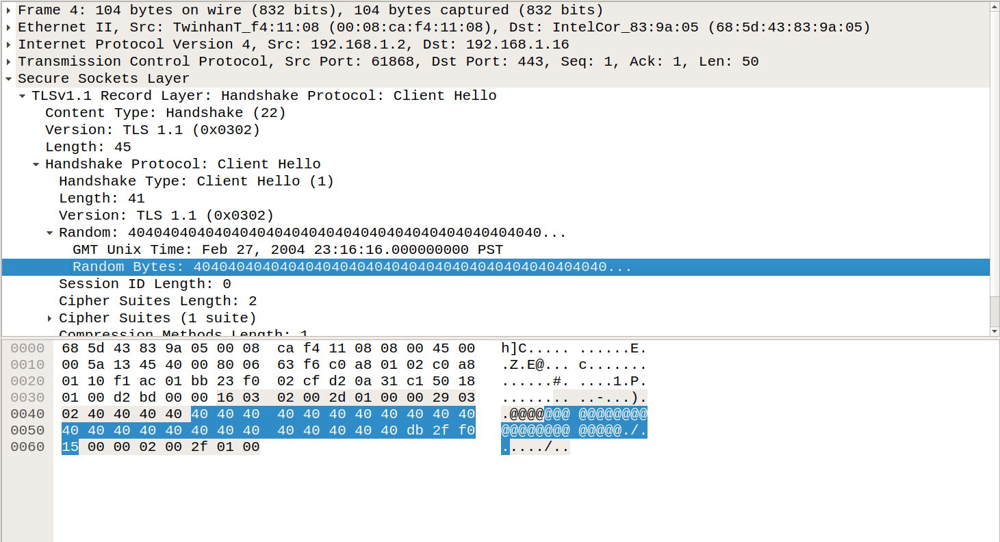
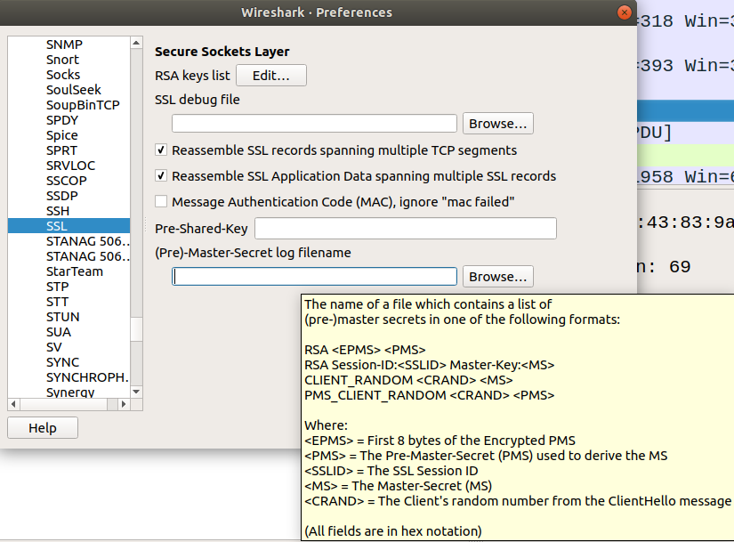
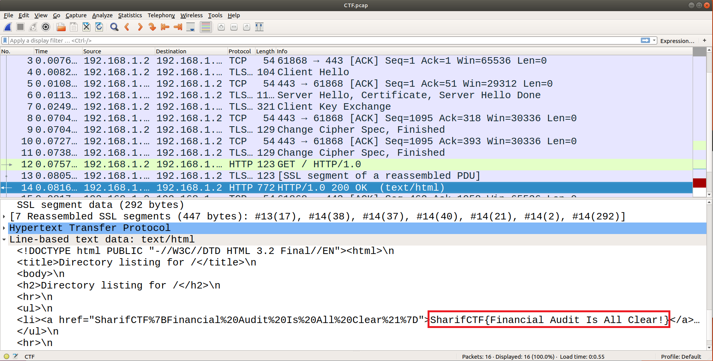

RichOil
===

**Category:** Misc **Points:** 400 + 80 (first blood bonus), **Solves:** 1, **Our rank:** 1


> The profitable RichOil company has many competitors. Recently, RichOil tried to reinforce infrastructure of its communication system security by outsourcing the cryptosystem design to a cryptographer.
> 
> Unfortunately, the cryptographer was hired by competitors to inject some intentional weakness in the system, for future exploits. They have recognized that the company’s financial audit lacks tax transparency. Also they have found some evidences in the weak-encrypted communications of the board of directors, with the help of the betrayer cryptographer.
> 
> Now you should act in role of the betrayer cryptographer. Find the encrypted evidence. Captured pcap traffic, and the manipulated cryptographic library, named “tlsfuzzer”, are attached.

### Write-up

So, we are given a pcap file with SSL/TLS traffic. Upon quick inspection there is one peculiarity in the captured TLS handshake, namely random bytes sent by the client look ... a bit biased:



These bytes, together with random bytes sent back by the server, and a so called premaster secret, are used to compute a master secret which, in turn, is the source session/encryption keys are derived from ([TLS 1.1 specs](https://tools.ietf.org/html/rfc4346#section-8.1)). If we could find the value of the premaster secret for this particular session we would be able to decrypt the traffic. Luckily, we won't have to calculate the master secret and the decryption key by hand as Wireshark will do this for us automatically when given the premaster secret.

Normally, the premaster secret is chosen randomly by the client or both parties, i.e., the client and server, agree upon it using the Diffie-Hellman protocol. In either case, the premaster secret is not sent in plaintext. But we know there's some custom TLS implementation involved here so perhaps it contains some bug? We have no option other than lurking into the implementation details as we were unable to spot any glaring weaknesses in the captured traffic.

Googling for the "tlsfuzzer" phrase yields [a github project](https://github.com/tomato42/tlsfuzzer) under this name but the code differs significantly from the one we are provided with in the challenge. However, the same author has an earlier, currently unmaintained, version of this library in his profile. It's called [sslfuzzerpython](https://github.com/tomato42/sslfuzzerpython). Almost a perfect match! "Almost" means there are some differences reported by the diff tool. There are a few changed lines in the actual TLS suite implementation (`tls1_1API.py` script) but these are rather irrelevant. It is the change in constants.py script that makes it significant. The original sslfuzzerpython had default constant values for, e.g., the premaster secret, defined there. The modified version uses the following code for generating client random bytes and premaster secrets.

```python

p=0xffffffef
g=2
y=0x6da68bf4L

k=int(binascii.hexlify(os.urandom(32)), base=16)
random=pow(g,k,p)
random_str=hexTostring(str(hex(random))[2:])
random_str=random_str.rjust(32,"@")

pmkey=pow(y,k,p)
pmkey_str=hexTostring(str(hex(pmkey))[2:])
pmkey_str=pmkey_str.rjust(46,"$")

DEFAULT_CH_CLIENT_RANDOM=random_str
tls11CKEPMKey = chr(3)+chr(2)+pmkey_str

```

(The implementation of the `hexToString` function was skipped - it is basically just an elaborate version of the built-in string's method `.encode('hex')`).


We have to deal with some randomness here - 32 bytes are picked (pseudo-)randomly and then  is raised to the th power modulo . The result is left-padded with `@`. Hence, the large number of leading `0x40` bytes we saw in the Client Hello message before.  is also used to calculate the premaster secret we are looking for.

32 bytes - that's a lot of guessing but since both values are calculated  it suffices to find  modulo , i.e., modulo the order of the multiplicative group of integers modulo . And  itself is very small (only four bytes long). We thus have a tiny instance of the discrete logarithm problem: 
<p align="center">
 </img>
</p>

where `g = 2`, `r = 0xdb2ff015 = 3677351957` (trailing bytes of the client random bytes), `p = 0xffffffef = 4294967279`. It can be solved in no time using Sage - we get that .

Plugging this last value as `k` into the above script we find that hex encoded `tls11CKEPMKey`, aka the premaster key, was `0302242424242424242424242424242424242424242424242424242424242424242424242424242424242424caf0e6d2`. Sweet.

It remains to decrypt the traffic. As mentioned before, Wireshark can handle this tedious job for us. We can point Wireshark to a log file containing client random bytes and premaster secret:



We craft a file with the following content:

```
PMS_CLIENT_RANDOM 40404040404040404040404040404040404040404040404040404040db2ff015 0302242424242424242424242424242424242424242424242424242424242424242424242424242424242424caf0e6d2
```

and then ...



Hello, flag!