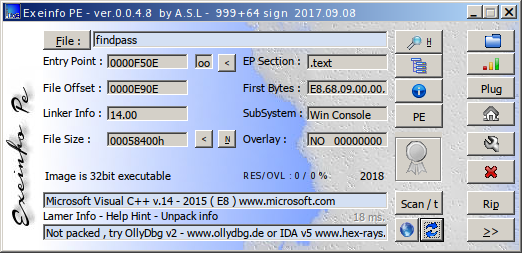

Keygen
======

**Category:** Reverse Engineering, **Points:** 200 + 20, **Solves:** 14 **Our rank:** 2

```
Find the password if you can!
```

### Write-up

In this challenge we are provided with an PE32 [executable](findpass) for Windows. First I loaded the binary in [exeinfo](http://exeinfo.atwebpages.com/).



As we can see the binary was probably written in C++. To verify this I ran `strings findpass | grep ios`
```
$ strings findpass | grep ios
iostream
iostream stream error
ios_base::badbit set
ios_base::failbit set
ios_base::eofbit set
.?AVios_base@std@@
.?AV?$basic_ios@DU?$char_traits@D@std@@@std@@
.?AVfailure@ios_base@std@@
```
At this point I was sure that we have a C++ binary. Unfortunately the binary was stripped and statically linked with the C++ runtime - we need to separate the C++ runtime from the important bits.
```
$ wine ./findpass
Enter Password Please:
1234567890

$ strings findpass | grep "Enter Password"
```
The string `Enter Password` was not present in the binary -> the string must be generated dynamically. To find the function responsible for displaying this string I loaded the binary in `Ollydbg` and stepped over the called functions until I saw the string displayed in the console. Then I repeated the debugging from the inside of the found function. By doing so we discover that `sub_406240` is the `main` of the binary. This function contains a lot of unused code to obfuscate the important bits. By stepping over the functions in main() we discover that `sub_409930` displays the searched string and `sub_403320` decrypts the string just before calling `sub_409930`. There are 2 calls to `sub_409930` in the binary -> the second call is inside an if statement. By jumping directly to the body of this if statement the string `Well done,Flag is md5 of input string.` is displayed. By using this information I determined that this string is displayed only if an array at `.data_456414` contains 5 ones. By searching for xrefs to this array I found 5 functions which set the fields of this array to 1 - `sub_404800`, `sub_405100`, `sub_405390`, `sub_405970`, `sub_405FA0`. After giving the C++ functions appropriate names the important bits of the main of the binary can be written in pseudocode as:
```c++
bool pass_ok[5] = {false, false, false, false, false};
int main() //Simplified a lot a lot
{
    std::string user_input;
    std::cout << "Enter Password Please:\n";
    std::cin >> user_input;
    char* tab[5] = split_input_by_spaces(user_input);
    run_check(sub_404800, tab[0]);
    run_check(sub_405100, tab[1]);
    run_check(sub_405390, tab[4]);
    run_check(sub_405970, tab[2]);
    run_check(sub_405FA0, tab[3]);
    if(all_true(pass_ok))
    {
        std::cout << "Well done,Flag is md5 of input string.";
    }
}
```
Each of the functions passed to `run_check` in pseudocode does the following:
```c++
void check(char* chunk) //Simplified a lot a lot
{
    if(compare(xor_cipher(hardcoded_key, chunk), hardcoded_values))
    {
        pass_ok[check_id] = 1;
    }
}
```
After reading off the hardcoded_key and hardcoded_values for each of the checks(stored in the binary as an std::string generated on the stack) and xoring them together we obtain the segments of the correct password. After concatenating them together in the right order we get `Flag: {HiBC NBG8L 965D LMSDF}`:
```
$ wine ./findpass
Enter Password Please:
Flag: {HiBC NBG8L 965D LMSDF}
Well done,Flag is md5 of input string.
$ echo -n "Flag: {HiBC NBG8L 965D LMSDF}" | md5sum
9a55042d8cba49ef460ac8872eff0902
```
So the flag is `SharifCTF{9a55042d8cba49ef460ac8872eff0902}`

###### By [gorbak25](https://github.com/grzegorz225) <gorbak25@gmail.com>

